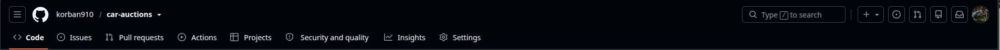
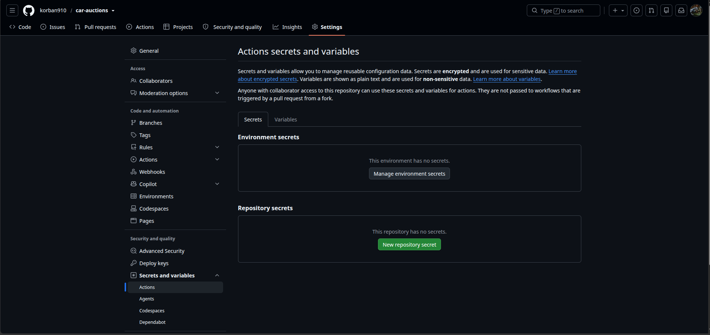
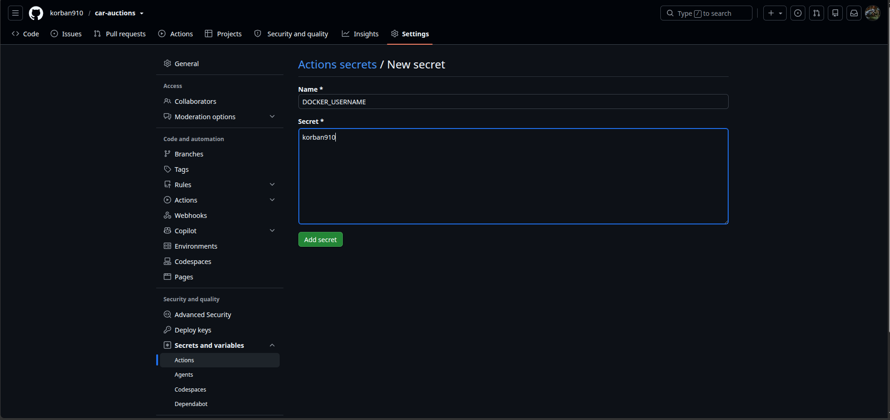
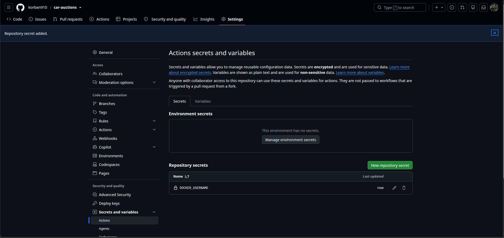
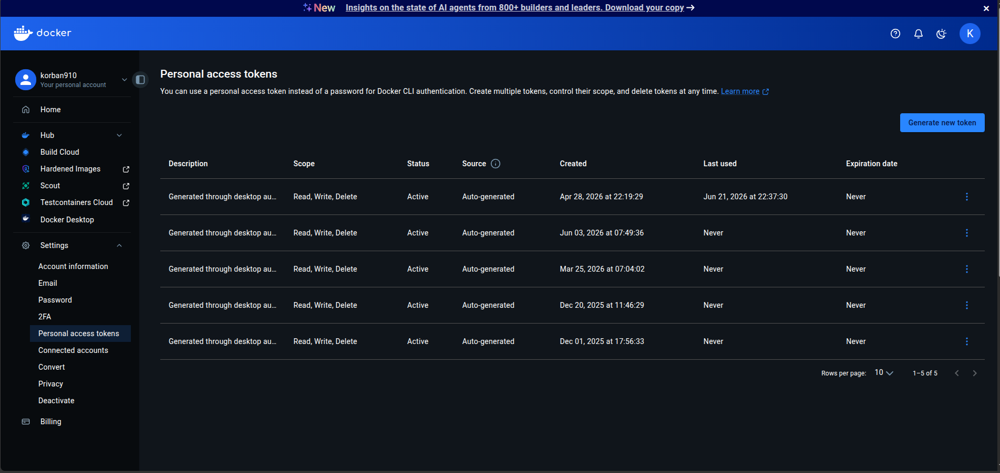
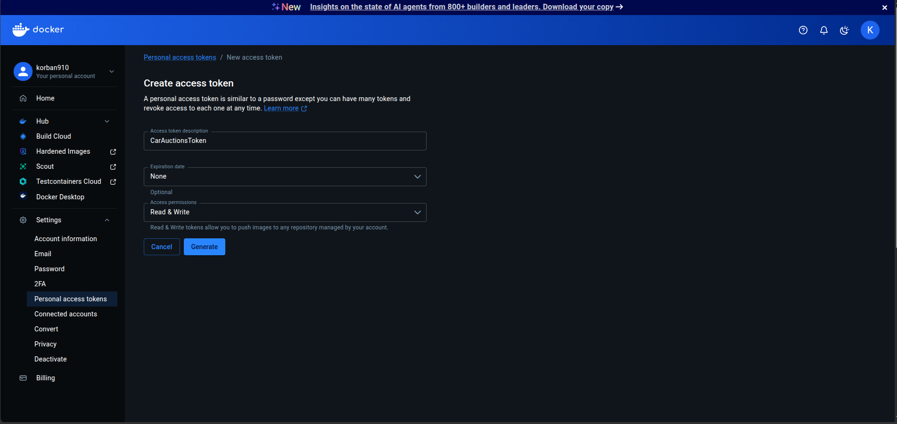
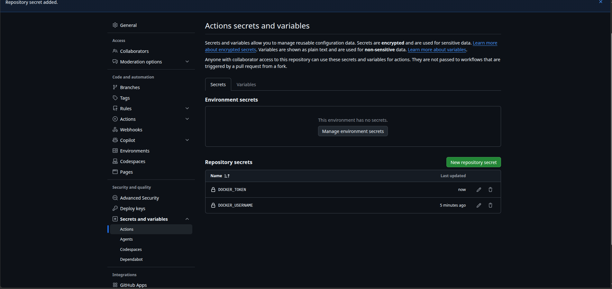

# GitHub Action

[← Back to Home](./README.md)

### Actions

In the `root` folder create `.github` folder. Then inside `.github` folder, create `workflows`. Inside the `workflows` folder create `deploy.yml` file. 

deploy.yml:
```
name: Build and publish

on:
  workflow_dispatch: 
  push:
    branches: [ "main" ]

jobs:
  build-and-push:
    runs-on: ubuntu-latest
    strategy:
      matrix: 
        service:
          - name: 'korban910/auction-svc'
            path: 'src/AuctionService'
    steps:
      - name: Checkout code
        uses: actions/checkout@v4
        
      - name: Set up Docker buildx
        uses: docker/setup-buildx-action@v2
      
      - name: Login to Docker
        uses: docker/login-action@v3
        with:
          username: ${{secrets.DOCKER_USERNAME}}
          password: ${{secrets.DOCKER_TOKEN}}
      
      - name: Build and push docker image
        uses: docker/build-push-action@v6
        with:
          context: .
          file: ${{matrix.service.path}}/Dockerfile
          push: true
          tags: ${{matrix.service.name}}:latest
```

### GitHub













From above generate the `Token` then assign it same as `Username` in the `GitHub`.

