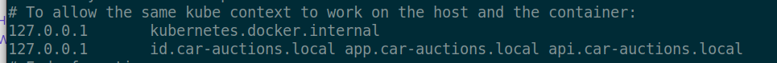

# mkcert

[← Back to Docker](../DOCKER.md)

Go to [mkcert](https://github.com/filosottile/mkcert) to follow `mkcert` install.

```
mkcert -install
```

Use `sudo vi /etc/hosts`:


Inside `devcerts` folder:

```
mkcert -key-file car-auctions.local.key -cert-file car-auctions.local.crt app.car-auctions.local api.car-auctions.local id.car-auctions.local
```

